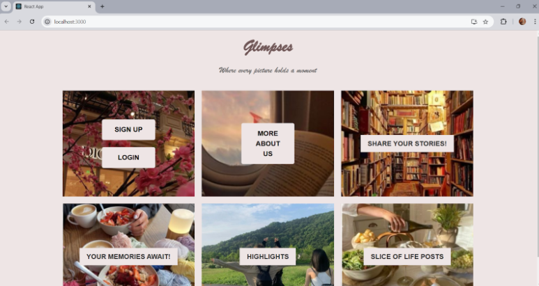
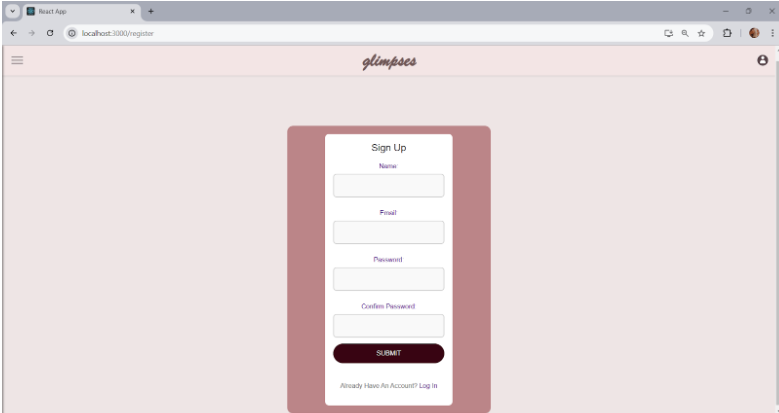
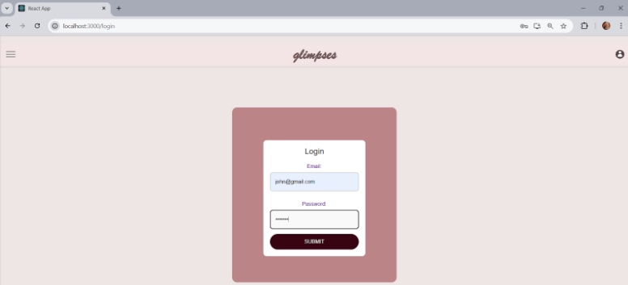
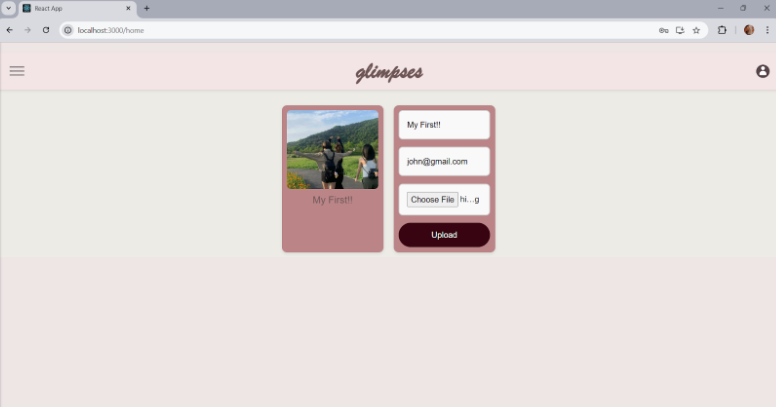
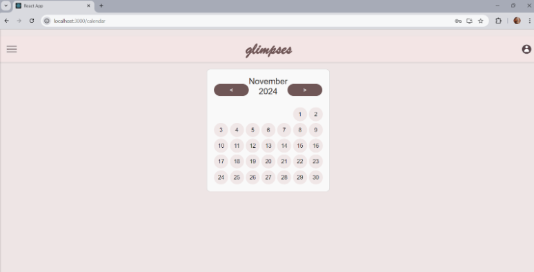
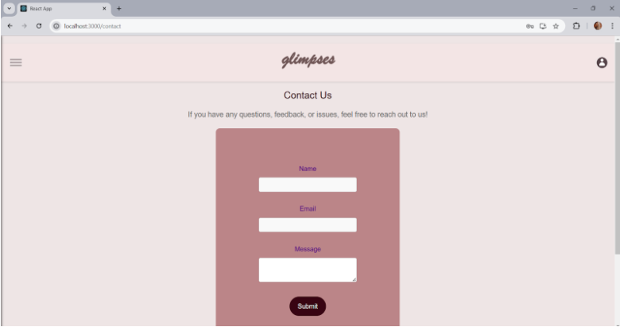
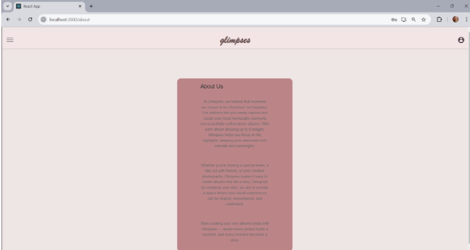
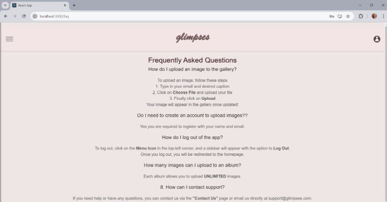

# Glimpses - A Time Capsule for Memories

**Glimpses** is a nostalgic web application that allows users to preserve their memories by uploading and viewing images with optional captions. Users can revisit their personal memory capsule anytime and share feedback with the creators.

---

## Features

- **User Authentication**
  - Sign up and log in securely.
  
- **Image Upload and Display**
  - Upload images with captions.
  - Images are stored on the local server.
  - Image URLs and captions stored in MongoDB.
  - Displayed as a personalized memory timeline.

- **Calendar Integration**
  - View images by upload date for a chronological feel.

- **Feedback Page**
  - Users can send feedback and suggestions.

- **Informational Pages**
  - About Us page describing the project.
  - FAQs to answer common questions.

---

## Tech Stack

### Frontend
- **React.js** – Building dynamic and responsive UI components
- **JavaScript** – Handling interactivity
- **HTML/CSS** – Layout and styling

### Backend
- **Node.js** with **Express.js** – Server logic, routing, authentication, and API
- **Multer** – Middleware for handling image uploads to local storage

### Database
- **MongoDB** – Stores image metadata (URLs, captions) and user data

### Image Storage
- Images are uploaded and stored on the local server filesystem.
- Only image paths/URLs are saved in the database for retrieval.

---

## 🖼️ Screens Overview

| Screen       | Functionality                                                                 | Screenshot                        |
|--------------|--------------------------------------------------------------------------------|---------------------------------|
| **Landing Page** | Welcomes users and offers navigation to login or sign up                      |    |
| **Sign Up**      | Allows new users to create an account and stores user data in MongoDB         |                |
| **Login**        | Authenticates existing users and retrieves user session                       |                    |
| **Images**       | Displays all uploaded images and their captions for the logged-in user        |                  |
| **Calendar**     | Enables users to view memories by upload date                                 |              |
| **Feedback**     | Users can send suggestions or comments about the website                      |              |
| **About Us**     | Describes the purpose and vision of the Glimpses project                      |              |
| **FAQs**         | Displays answers to commonly asked questions                                  |                       |

